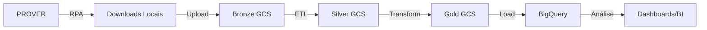

# Arquitetura do Sistema RPA PROVER

## Visão Geral

O sistema RPA PROVER segue uma arquitetura em camadas, utilizando o padrão de arquitetura medalhão (Bronze/Silver/Gold) para processamento de dados.

## Camadas da Aplicação

### 1. Camada de Apresentação (CLI)
- **Arquivo:** `main.py`
- **Responsabilidade:** Interface de linha de comando para execução do sistema
- **Modos de execução:**
  - `full`: Pipeline completo
  - `extract`: Apenas extração
  - `etl`: Apenas processamento
  - `bigquery`: Apenas carga

### 2. Camada de Automação (RPA)
- **Módulo:** `src/rpa/`
- **Responsabilidade:** Automação do sistema PROVER usando Selenium
- **Componentes:**
  - `ProverScraper`: Classe principal de automação
  - Login automático
  - Navegação por instituições
  - Download de relatórios

### 3. Camada de Armazenamento
- **Módulo:** `src/storage/`
- **Responsabilidade:** Upload e gerenciamento de arquivos no GCS
- **Componentes:**
  - `GCSUploader`: Upload para Google Cloud Storage
  - Estruturação em camadas (Bronze/Silver/Gold)
  - Metadados de arquivos

### 4. Camada de Processamento (ETL)
- **Módulo:** `src/etl/`
- **Responsabilidade:** Transformação de dados entre camadas
- **Componentes:**
  - `BronzeToSilverProcessor`: Limpeza e padronização
  - `SilverToGoldProcessor`: Modelagem dimensional

### 5. Camada de Dados (Database)
- **Módulo:** `src/database/`
- **Responsabilidade:** Integração com BigQuery
- **Componentes:**
  - `BigQueryLoader`: Carga de dados
  - Criação de tabelas dimensionais
  - Queries e estatísticas

### 6. Camada de Utilitários
- **Módulo:** `src/utils/`
- **Responsabilidade:** Funcionalidades compartilhadas
- **Componentes:**
  - Logger customizado (Loguru)
  - Exceções personalizadas
  - Helpers diversos

## Arquitetura Medalhão

### Bronze (Dados Brutos)
```
gs://p96-ipp/bronze/prover/{instituicao}/{data}/{arquivo}
```
- Dados exatamente como extraídos do sistema
- Formato original (CSV, Excel, etc.)
- Imutável
- Rastreabilidade completa

### Silver (Dados Processados)
```
gs://p96-ipp/silver/prover/{instituicao}/{data}/{arquivo}.parquet
```
- Dados limpos e padronizados
- Formato Parquet (otimizado)
- Tipos de dados corrigidos
- Valores nulos tratados

### Gold (Dados Analíticos)
```
gs://p96-ipp/gold/prover/{tabela}/{data}/{arquivo}.parquet
```
- Modelo dimensional (Star Schema)
- Tabelas dimensão e fato
- Pronto para análise
- Carregado no BigQuery

## Fluxo de Dados



## Modelo de Dados (Gold)

### Dimensões

#### dim_instituicao
- id_instituicao (PK)
- nome_instituicao_normalizado
- nome_instituicao

### Fatos

#### fato_movimento_financeiro
- id_movimento (PK)
- id_instituicao (FK)
- data_processamento
- data_carga
- [campos específicos dos relatórios]

## Padrões de Design

### 1. Factory Pattern
- Inicialização de clientes (GCS, BigQuery)
- Criação de drivers do Selenium

### 2. Strategy Pattern
- Processamento de diferentes formatos de arquivo
- Múltiplos modos de execução

### 3. Pipeline Pattern
- Sequência de transformações Bronze → Silver → Gold
- Cada etapa independente e testável

### 4. Repository Pattern
- Abstração de acesso ao GCS
- Abstração de acesso ao BigQuery

## Configuração

### Arquivo .env
Todas as configurações sensíveis são armazenadas em variáveis de ambiente:
- Credenciais PROVER
- Configuração GCP
- Parâmetros do RPA
- Níveis de log

### settings.py
Validação e centralização de configurações usando Pydantic.

## Segurança

### Credenciais
- Armazenadas em `.env` (não versionado)
- Service account keys em `config/` (não versionado)
- Rotação periódica recomendada

### Acesso GCP
- Princípio do menor privilégio
- Service accounts com permissões específicas:
  - Storage Object Admin (GCS)
  - BigQuery Data Editor
  - BigQuery Job User

## Monitoramento e Logs

### Logs
- Console: tempo real com cores
- Arquivo: rotacionado (10MB), retido por 30 dias
- Níveis: DEBUG, INFO, WARNING, ERROR

### Rastreabilidade
- Metadados em todos os arquivos GCS
- Timestamps em todas as operações
- Origem de dados sempre preservada

## Escalabilidade

### Horizontal
- Múltiplas execuções paralelas (diferentes datas)
- Processamento distribuído no GCS
- BigQuery escala automaticamente

### Vertical
- Otimização de queries
- Uso de Parquet (compressão)
- Cache de resultados

## Manutenção

### Atualizações de Dependências
```bash
pip list --outdated
pip install -U <package>
```

### Testes
```bash
pytest tests/ -v --cov
```

### Code Quality
```bash
black src/
isort src/
flake8 src/
```

## Próximas Evoluções

1. **Orquestração:** Integração com Apache Airflow ou Cloud Composer
2. **Alertas:** Integração com sistemas de alerta (email, Slack)
3. **Dashboard:** Painel de monitoramento do pipeline
4. **ML:** Detecção de anomalias nos dados financeiros
5. **API:** Exposição via REST API para consultas

## Referências

- [Arquitetura Medalhão - Databricks](https://www.databricks.com/glossary/medallion-architecture)
- [Google Cloud Storage Best Practices](https://cloud.google.com/storage/docs/best-practices)
- [BigQuery Best Practices](https://cloud.google.com/bigquery/docs/best-practices)


